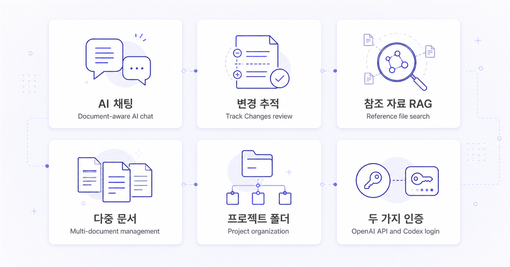
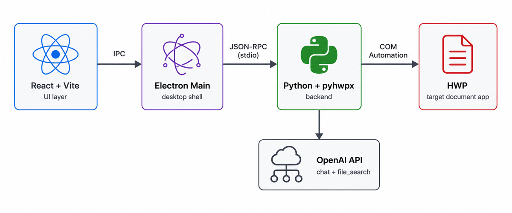
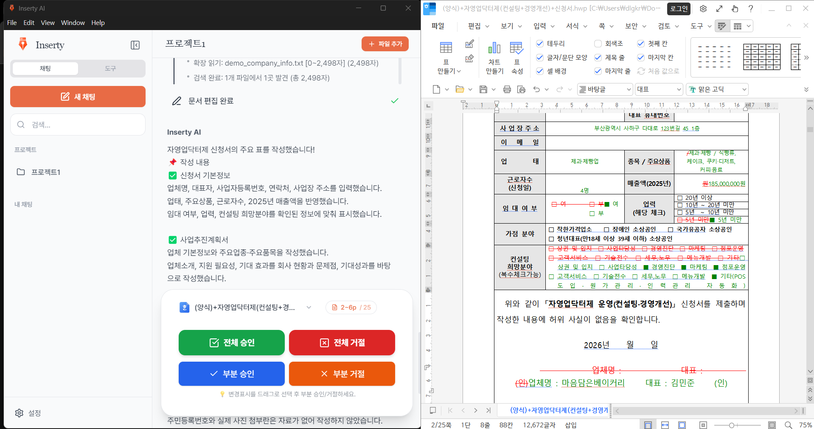

<div align="center">


# Inserty AI

**AI로 한글(HWP) 문서를 편집하는 데스크탑 앱**

*AI-powered desktop editor for Korean Hangul Word Processor (HWP) documents*

[](https://www.gnu.org/licenses/agpl-3.0)
[](https://github.com/Dayy9984/insertyai/releases)
[](https://www.microsoft.com/windows)
[](https://www.hancom.com/)
[](https://github.com/Dayy9984/insertyai/stargazers)

[설치 / Install](#-설치--install) ·
[작동 방식](#-작동-방식--how-it-works) ·
[주요 기능](#-주요-기능--features) ·
[개발 / Develop](#-개발--development) ·
[기여 / Contribute](#-기여--contributing)

</div>

---

## ✨ 한 줄 소개

HWP 양식(신청서·계획서·보고서)의 표·셀 구조에 맞춰 **AI가 셀 단위로 정확히 채워주는** 데스크탑 앱입니다. 실행 중인 한글 프로세서에 COM 자동화로 연결되어, 채팅으로 받은 지시를 즉시 문서에 반영하고 변경 추적 기능으로 한 건씩 검토할 수 있습니다.

> **For non-Korean readers**: Inserty AI is a Windows desktop application that connects to an already-running HWP (Korean Hangul Word Processor) instance via COM automation. The user describes edits in natural language; an LLM produces structured cell-level edit commands which are applied in real time, while every change goes through HWP's native Track Changes flow for review.

---

## 🌟 주요 기능 / Features



| 기능 | 설명 |
|------|------|
| 💬 **AI 채팅** | 현재 열린 HWP 문서를 자동으로 컨텍스트로 인식. 자연어로 편집 지시 |
| ✓ **변경 추적 (Track Changes)** | AI가 만든 변경을 한 건씩 또는 일괄로 승인/거절 |
| 📎 **참조 자료 업로드** | 채팅·프로젝트에 파일 업로드 → AI가 검색해 문맥에 맞는 내용 작성 |
| 🪟 **다중 문서** | 동시에 열린 여러 HWP 창을 인식·전환·편집 |
| 📁 **프로젝트 폴더** | 채팅과 참조 파일을 사업/주제별로 묶어 관리 |
| 🔑 **두 가지 인증** | OpenAI API 키 또는 ChatGPT Codex 계정 둘 다 지원 |

---

## 🔧 작동 방식 / How It Works



1. **한글 문서 추출** — Python이 HWP COM에서 문서 구조를 토큰 효율적인 HTML-like 마크업으로 직렬화 (`<table>`, `<td id="N">`, `<p id="N">` + 속성)
2. **AI 분석** — 사용자 요청과 HDML를 함께 LLM에 전달. 모델이 셀 ID 기준 편집 명령(`replace_cell_content`, `replace_paragraph` 등) 생성
3. **실시간 적용** — Python이 명령을 받아 HWP에 즉시 반영. 진행 상황이 UI에 스트리밍됨
4. **변경 추적** — 모든 변경은 HWP의 Track Changes로 기록되어 사용자가 검토·승인·거절 가능

### 컴포넌트 간 통신

```
React/Vite UI  ──IPC──▶  Electron Main  ──JSON-RPC (stdio)──▶  Python + pyhwpx  ──COM──▶  HWP
                              │
                              ▼
                        OpenAI API (chat + file_search RAG)
```

---

## 📸 스크린샷 / Screenshot

<div align="center">

<p><em>좌측: 채팅·프로젝트 폴더 · 중앙: AI 채팅 · 우측: HWP 양식 미리보기</em></p>
</div>

---

## 💡 사용 시나리오

### 1. 양식 문서 채우기

HWP로 신청서 양식을 열어 둔 채 채팅으로:

```
이 신청서에 다음 내용을 채워주세요.
- 회사명: 테스트상회
- 대표자: 홍길동
- 사업자등록번호: 123-45-67890
```

→ AI가 라벨 셀과 입력 셀을 구분해서 정확한 위치에 값 기입.

### 2. 참조 자료 기반 작성

채팅에 사업계획서 PDF 업로드 후:

```
업로드한 사업계획서를 바탕으로 예비창업패키지 양식의
2~6페이지를 개조식으로 채워주세요.
```

→ RAG가 PDF에서 관련 섹션을 검색하여 양식 구조에 맞춰 작성.

### 3. 검토 후 일부만 적용

AI가 만든 모든 변경은 **변경 추적**으로 기록. 사이드 패널에서 한 건씩 보고 ✓ 또는 ✗로 결정하거나 페이지 단위 일괄 처리 가능.

---

## 🖥 지원 환경 / Supported Platforms

| OS | HWP 버전 | 비고 |
|----|---------|------|
| Windows 10 / 11 (x64) | 2018, 2020 (32-bit) | 자동 감지 |
| Windows 10 / 11 (x64) | 2022, 2024 (64-bit) | 자동 감지 |

**필요 환경**:
- Windows 10 빌드 19041 이상
- 인증: OpenAI API 키 (`sk-...`) **또는** ChatGPT Codex 로그인
- HWP 본체가 시스템에 설치되어 있어야 함

---

## 📦 설치 / Install

### A. 배포된 인스톨러로 설치 (권장)

[Releases](https://github.com/Dayy9984/insertyai/releases) 페이지에서 `Inserty AI_<version>_Setup.exe`를 받아 실행.

### B. 소스에서 빌드

#### Prerequisites

- [Node.js 20+](https://nodejs.org/)
- [pnpm 9+](https://pnpm.io/)
- [Python 3.12](https://www.python.org/)
- [uv](https://docs.astral.sh/uv/) (Python 패키지 관리)
- HWP 2018 이상 설치

#### 빌드

```bash
git clone https://github.com/Dayy9984/insertyai.git
cd insertyai
pnpm install
pnpm build
```

빌드 결과: `release/<version>/Inserty AI_<version>_Setup.exe`

> 첫 빌드는 Python을 Nuitka로 컴파일하느라 약 **20~40분** 걸립니다. 이후 빌드는 캐시 덕에 빠릅니다.

---

## 🚀 개발 / Development

```bash
pnpm dev    # Vite + Electron + Python 서브프로세스 동시 기동
```

`.env` 파일 (선택):

```env
# OpenAI API 모드를 쓸 경우 (선택)
VITE_OPENAI_API_KEY=sk-proj-...

# 자체 인스톨러 업데이트 피드 (선택)
UPDATE_FEED_URL=https://inserty-release-worker.snsoffice.workers.dev/auto-update/
```

> Codex 모드만 쓴다면 `VITE_OPENAI_API_KEY`는 비워둬도 됩니다. 앱 안의 설정 → AI에서 ChatGPT 계정으로 로그인하세요.

### 테스트

```bash
pnpm exec vitest run                  # 프론트엔드 (vitest)
cd python && python -m pytest tests/  # 백엔드 (pytest)
```

---

## 📂 프로젝트 구조

```
insertyai/
├── electron/                       # Electron 메인 + preload (TypeScript)
│   ├── main/                       # IPC 핸들러, 창 관리, Python 브리지
│   ├── preload/                    # contextBridge API
│   └── services/                   # Python 통신, SQLite, 자동 업데이트
│
├── src/                            # React 프론트엔드 (TypeScript)
│   ├── components/                 # UI 컴포넌트 + 모달 + 팝오버
│   ├── stores/                     # Zustand 상태 스토어
│   ├── hooks/                      # 커스텀 훅
│   └── utils/                      # 유틸리티 (DnD, 채팅 순서 등)
│
├── python/                         # Python 백엔드 (3.12)
│   ├── hwp_com_process.py          # 메인 JSON-RPC 서버 (HWP COM)
│   ├── agent_process.py            # LLM/RAG 에이전트 (스트리밍)
│   ├── hwp_window_monitor.py       # HWP 창 감지·모니터
│   ├── file_reader_process.py      # 파일 읽기 서브프로세스
│   ├── build_python.py             # Nuitka 빌드 스크립트
│   │
│   ├── api/                        # 외부 API 래퍼 (track_changes 등)
│   ├── edit/                       # 편집 호환 shim 레이어
│   ├── engine/                     # COM/세션 엔진
│   │   ├── connection/             #   ROT 접근·문서 커넥터
│   │   ├── analysis/               #   콘텐츠 분석기
│   │   └── state/                  #   세션 상태 관리
│   ├── llm/                        # LLM 통합
│   │   ├── streaming_client.py     #   OpenAI 스트리밍 (Codex 포함)
│   │   ├── system_prompt_v7_11.py  #   시스템 프롬프트 v7.11
│   │   └── edit_tools_schema.py    #   도구 스키마 (execute_edits 등)
│   ├── modification/               # 문서 수정 엔진 (content_modifier 등)
│   ├── parsing/                    # HWPML 파서
│   ├── processing/                 # HDML 추출 파이프라인
│   │   ├── extraction/             #   HDML 추출기
│   │   ├── conversion/             #   마크업 변환기
│   │   ├── structure/              #   문서 구조 빌더 (Enriched HDML)
│   │   └── detection/              #   form/table 감지
│   ├── readers/                    # PDF/Word/Excel 파일 리더
│   ├── services/                   # 파일 검색·RAG·diff·세션
│   ├── session/                    # 세션 매니저
│   ├── utilities/                  # COM 유틸·예외 처리
│   ├── utils/                      # 로깅·HWPML 유틸
│   └── tests/                      # pytest (131 tests)
│
├── api문서/                         # 한컴 HWP API 레퍼런스 (Korean)
├── build/                          # 앱 아이콘, NSIS 인스톨러 스크립트
├── test/                           # vitest 프론트엔드 테스트
├── docs/images/                    # README 이미지
└── release/                        # 빌드 산출물 (gitignored)
```

---

## 🛠 기술 스택 / Tech Stack

| Layer | Tech |
|-------|------|
| Desktop shell | Electron 33 |
| UI | React 18 + TypeScript 5.4 + Tailwind CSS |
| State | Zustand |
| Local DB | SQLite (better-sqlite3) |
| HWP bridge | Python 3.12 + [pyhwpx](https://github.com/mrchypark/pyhwpx) (COM automation) |
| AI / RAG | OpenAI API (chat + file_search) · ChatGPT Codex 호환 |
| IPC | JSON-RPC over stdio |
| Build | Vite · Nuitka · electron-builder (NSIS) |

---

## 🗺 로드맵

- [x] HWP 2018/2020/2022/2024 호환
- [x] OpenAI API + ChatGPT Codex 두 가지 인증
- [x] AGPL-3.0 오픈소스화
- [ ] macOS 지원 (한글 macOS COM 대안 검토)
- [ ] 로컬 LLM 백엔드 (Ollama / LM Studio)
- [ ] 워드(.docx) 동시 지원
- [ ] 다국어 UI (현재 한국어 only)

---

## 🤝 기여 / Contributing

오픈소스 기여를 환영합니다.

1. 이슈 등록: 버그 / 기능 요청
2. PR: 새 기능은 작은 단위로 나누고, 가능하면 테스트 동반
3. 코드 스타일: ESLint / Ruff 설정 따름
4. PR 제출 전 `pnpm exec vitest run`과 `pytest`가 모두 통과하는지 확인

---

## 📄 라이선스 / License

본 프로젝트는 **AGPL-3.0** 라이선스로 배포됩니다.

- **개인 사용 / 비상업적 사용** — 자유롭게 사용·수정·배포 가능 (소스 공개 의무)
- **상업적 사용 / 폐쇄형 통합** — 별도 상업 라이선스 필요. 문의: **hakbin9984@gmail.com**

자세한 내용은 [`LICENSE`](./LICENSE) 참고.

---

## 🙏 크레딧 / Credits

- HWP COM 자동화: [pyhwpx](https://github.com/mrchypark/pyhwpx) (MIT)
- 데스크톱 셸: [Electron](https://www.electronjs.org/) (MIT)
- AI: [OpenAI API](https://openai.com/)
- UI: [React](https://react.dev/) · [Tailwind CSS](https://tailwindcss.com/) · [Lucide Icons](https://lucide.dev/) · [Pretendard](https://github.com/orioncactus/pretendard)
- 빌드: [Vite](https://vitejs.dev/) · [Nuitka](https://nuitka.net/) · [electron-builder](https://www.electron.build/)

---

<details>
<summary><b>⭐ Star History</b></summary>

<a href="https://star-history.com/#Dayy9984/insertyai&Date">
  <picture>
    <source media="(prefers-color-scheme: dark)" srcset="https://api.star-history.com/svg?repos=Dayy9984/insertyai&type=Date&theme=dark" />
    <source media="(prefers-color-scheme: light)" srcset="https://api.star-history.com/svg?repos=Dayy9984/insertyai&type=Date" />
    
  </picture>
</a>

</details>

---

<div align="center">

문의 / 제안: **hakbin9984@gmail.com**

Made with ❤️ in Korea

</div>
